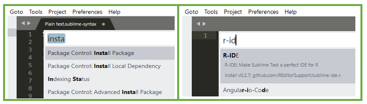
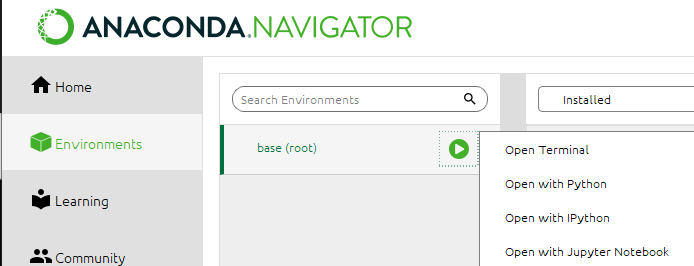
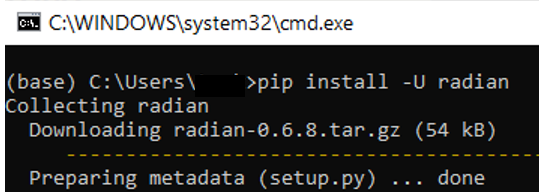
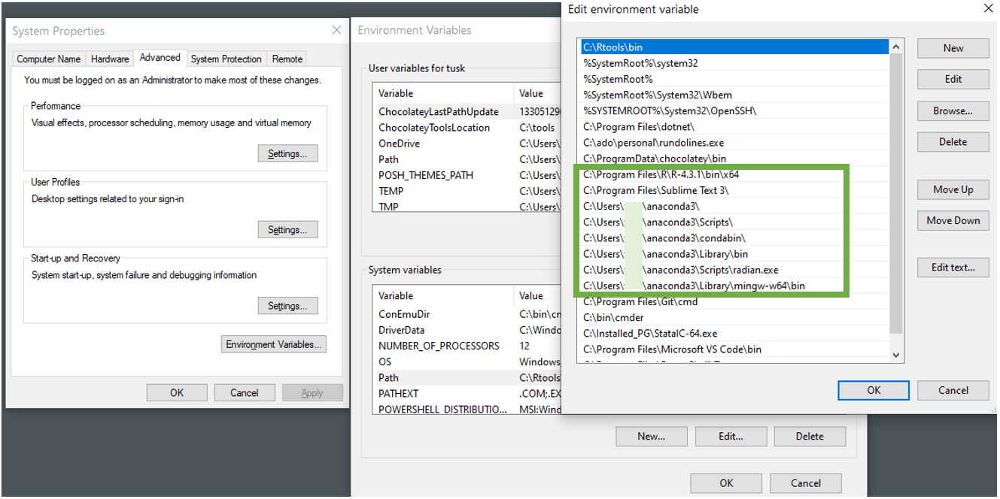

# Creative Workflow using R and Sublime Text

## Efficient workflow: Jumping between projects and files like a ninja

**Nov 2023, Sook Kim - University of Manchester**

*Target audience*: Anyone who is engaged in coding and/or data management, and keen to explore software or tools available to improve their workflow. At a practical level, students or researchers who need to manage multiple projects and need a system that allows ongoing coding training at your own pace will benefit from this training. The other important purpose is to help facilitate your creative workflow! Soon, you'll see what I mean!

Welcome to the workshop! We will discuss challenges in project management and creative ways to manage the ongoing project better using one of the most versatile and powerful tool, **Sublime Text 3**. I will walk you through all the steps necessary to integrate R and Sublime in [Part 3](#part3). This training aims to *revolutionise* your workflow. Please note that you will experience a *qualitative* difference in writing, and project/resources management. You may not save much time at first (as this involves some learning curve), but it is the qualitative aspect that you will appreciate over time! 

# Preliminary Steps

Install R (<https://www.r-project.org/>) and Sublime Text 3 Build 3211 (<https://www.sublimetext.com/3>). In Sublime Text 3 (ST3) menu,

-   In ST3, Go to `Tools > Install Package Control...` and allow a few seconds to run.

-   In ST3, Press `Ctrl+K, Ctrl+B`. Repeat to see what happens.

The user-contributed packages in ST3 are managed by Package Control. We need to install Package Control first, to be able to install packages that permit rich features of ST3! The shortcut, `Ctrl+K, Ctrl+B`, enables us to access the entire folder tree (called sidebar) in ST3. If a folder is open, ST3 reveals the entire hierarchy.

Before we proceed, let's install *languageserver* to help ST3 communicate with R. This can be done later in ST3, but let's keep it simple for now by running the code in RStudio.

-   In RStudio, run, `install.packages("languageserver")`

> [!IMPORTANT] 
> This step is crucial. Please ensure languageserver installation was successfully done, and no errors has occurred (See below [Troubleshooting](#Troubleshooting) to resolve any errors). Now, we are ready for next steps! (*Unlike RStudio, ST3 needs manual setup. It involves installing (user-contributed) packages and configuring them to let ST3 recognise R language and prints output*).

# Part 1: Managing projects

Have you been given training on project management? Why or why not? Often times, we embark on an amazing project but we may have to revisit in six months' time or collaborate with others. Let's contemplate on a few things.

-   How often do you struggle locating folders and files?
-   Do you memorise code or do you google whenever needed?
-   Do you feel there is a need to better organise tutorial materials?
-   Do you like repeating tasks?
-   How comfortable are you with sharing your code?

It'd be nice to have a project template with relevant folders ready and organising is nicely done already.

## Project folder management :

-   **Folders**: R script that creates folders/sub-folders (In the repository, see [example folder-creating R script](Project_management/03_Create_Folders.R) located under *Project_management* folder.

-   **Folder/file naming conventions**: consider giving sequence to sort in numbers

-   **Sub-folders**: If the file is buried under somewhere, it's time to consider sub-folders.

-   **Section dividers**: Sometimes, we just need many folders and hiding them in a sub-folder may not be optimal. In such instance, you can be creative to stand out particular folders among others.

## An important consideration for Code sub-folders

In structuring "code sub-folders": An important consideration can be given to...?

How about accessing this folder hierarchy while working on a particular project? It'd be nice to know the current file's location as you write code, which will enable ongoing organising! Is there any available tool I can utilise?

## Training and development:

The coding journey is an ongoing process and you may benefit from your own code bank. Create a master tutorial folder that allows you to access any code example that you have been exposed to. Discovering a good solution in `stackoverflow` is only one step. Before it evaporates, we need a good "home" to house this *precious*(!) code for future access.

Now, how do we access the most relevant file immediately? Manually navigating folders in File Explorer will be very slow. More importantly, how do we minimise disruption in your current workflow and shift your focus from training to the current project?

# Part 2: Introducing Modern External Text Editors

### and their caveats

This is where Modern External Text Editors come in. Modern Text Editors are like `RStudio`. As the name suggests they are used to write code. The main strength of these is that they often offer many useful features, which are not available in RStudio. They are usually light-weight, fast, and aesthetically-pleasing. RStudio is a great platform for your projects. Once you are proficient with RStudio, you may consider other options. It'll be efficient if you can allocate other editors to conducting tasks such as housing tutorial materials or testing code. This will help with your workflow; By separating tasks, you can minimise disruption.

You'll learn a new function, test it in your tutorial environment before seamlessly returning to your project at hand. Also, it is a bonus that there is no need to tidy up code afterwards (well, not so thoroughly!). Sublime Text 3 and Visual Studio Code are two popular External Text Editors among many. The reason behind choosing these is that the customisation possibility is almost endless! From aesthetics and shortcuts, you can adjust almost anything to meet your needs.

However, I must highlight that given the moderate-to-steep learning curve, the potential time and efforts required to use editors confidently should not be ignored. You may need to tackle various aspects of technical issues! Please weight up pros and cons as you play with them. Remember to learn at your own pace! If you think the benefits do not outweigh, it's best to leave this for now, or reconsider your learning pace, and revisit when you are more equipped. Personally, it is too great to dismiss it, though!

## Opening the R_Tutorial folder in Sublime Text 3 (ST3)

While many programming languages can be run from within Sublime Text 3, our main purpose is to set it as a platform to learn and test our R code.

-   First, we will create our own R-tutorial folder in File Explorer. We'll open it in ST3.

-   Launch ST3 and see the entire folder tree (called sidebar) (Recall Ctrl+K, Ctrl+B).

-   Go to File \> Open Folder... and choose the R_Tutorial folder. You'll see the entire folder hierarchy at a glance.

-   Right-click R-Tutorial folder, then explore options.

-   Open the provided files there. An *.md* file is essentially a *.txt* file but it comes with many frills. Try with \# and \## to make a to-do list (Converting is not necessary as our goal is making notes!).

## Demonstration of key features in ST3

-   Running R code interactively
-   Jumping between projects (using *Project Manager* package, Ctrl+Alt+P)
-   File management (using *SideBarEnhancements* package)
    -   move files between panels
    -   find location of the current file in the folder tree
    -   launch a particular tutorial file for a quick reference (Ctrl+P)
    -   New View into file - no more back and forth scrolling!
    -   Jump between sections

Watch the video (Please unmute first. Instructions begin in 15 seconds)

https://github.com/sook-tusk/Tech_Creative_Workflow_Using_R_and_Sublime/assets/120035640/6230c2a6-8926-4df7-8d88-53b49354694e

# Part 3: Integrating R and Sublime Text 3 <a href="#part3" id="part3"/>

## Step 1: Install packages in Sublime Text 3 (ST3)

Press `Ctrl+Shift+P`. This triggers an *empty* drop-down window. This window is called Command Palette. The cursor is waiting for a command in the Command Palette. Start typing "Install Package" then press Enter. In a few seconds, when the Command Palette window appears again, type "r-ide", and press Enter. Notice the updating message at the bottom left of the ST3 window, to see the confirmation of the installation status (such as "*R-IDE package was installed successfully*"). Repeat this process to install other packages.The packages we need are :

-   R-IDE (to get syntax highlights),

-   LSP (Language Server support in Sublime to use R)

-   SendCode (to help communicate ST3 and Terminal), and

-   Terminus (to use as console showing output).



## Step 2: Configure ST3

### R-IDE

We ensure Sublime Text recognises your R version and path. In Sublime Text menu, go to `Preferences > Package Settings > R-IDE > Settings`. The panel on the right concerns the user customisation file. Copy below or edit as necessary.

```py
{
    "r_binary": "C:\\Program Files\\R\\R-4.3.1\\bin\\x64\\R.exe",
}
```

### LSP

No need to customise.

### SendCode

In the blank user customisation area, paste the following.

```py
{
    "r":
    {
        "prog": "terminus",
        "bracketed_paste_mode": false,
    },
}
```

### Terminus

Customise as necessary (if you are using Mac PC). *Terminus is a variant name referring to Terminal such as Command Prompt, PowerShell, and Bash*.

```py
{
      "default_config": {
        // "osx": null,      // login shell
         "windows": "Rterm",
  // If Radian won't work, use below, then type R from an R script
  // to manually activate Rterm
        // "windows": "Command Prompt",
    },
    // a list of available shells to execute
    "shell_configs": [
        {
            "name": "Rterm",
            "cmd": ["radian.exe"],
            "env": {},
            "enable": true,
            "platforms": ["windows"]
        },
  ],
} 
```

## Step 3: Install Radian

This setup allows you to run R code in ST3, but the console will print all in one colour. We need yet another python-powered programme called *radian* to get console output's highlights. *Radian* will automatically open `Rterm` (meaning R terminal). *Radian* is not available in ST3, and you need to install manually outside of ST3, via **anaconda**, the central python ecosystem manager.

### 3.1 Download and install anaconda.

Download here (<https://www.anaconda.com/download/>) and install it. 

### 3.2 Install radian

In your PC, launch anaconda navigator. Then, go to:

`Environments > base(root) > funnylookingtriangle > Open Terminal`



and execute the following command:

> pip install -U radian



## Step 4: Nearly done. Add paths as appropriate
Paths is one of the Windows PC system properties. Windows PCs look for an .exe in the paths set in the environment variable window. To bring up the environment variable window, type `env` at the search bar placed at the bottom left of the task bar.



Add R, Sublime Text 3, anaconda3, and radian folders. The paths for anacoda3 are not strictly required. If you are planning on running Python code in editors, consider adding them as well, though. 
Please note that .exe is not added at the end of the path. For R, it will be:

`C:\Program Files\R\R-4.3.1\bin\x64`

Restart PC after environment setting has changed.For the detailed instructions, see here [add-Windows-paths]
(https://helpdeskgeek.com/windows-10/add-windows-path-environment-variable/). For Mac PCs, follow similar procedures as necessary.

## Step 5: All done. Test running R code in ST3

Press `Ctrl+Shit+P`, type **SendCode: Choose Program**, then choose **Terminus**. This needs to be done only once.

Now, we are set to instruct Sublime to launch *Rterm*. Press Ctrl+Shit+P and type :

> Terminus: Open Default Shell in Tab (View).

When *Rterm* opens, run R code by pressing `Ctrl+Enter` in any R script file. *Voila*!

Close Sublime Text and test if Rterm is activated. Allow a minute for Rterm (from previous session) to relaunch itself (or click anywhere in Rterm for activation). Open another Rterm to ensure the current setup is working as intended. From now on, you can simply open Rterm to run R code. Well-done! :+1:

## Troubleshooting <a href="#Troubleshooting" id="Troubleshooting"/>


### Languageserver not connecting

.Rprofile needs updating. To do so, we need to locate, then open the file. Run the code below to find the path of .Rprofile.

```R
file.path(Sys.getenv("HOME"), ".Rprofile")                            
```
The output, `[1] "C:\\Users\\yourname\\Documents/.Rprofile"` indicates the location. Launch File Explorer and open the file. It is a plain text file. Add the location detail in the .Rprofile.

``` py
options(langserver_library = 'C:/Users/yourname/Documents/R/win-library/4.3/languageserver')
    
    .First <- function () {
        path_to_libraries <- "C:/Users/yourname/Documents/R/win-library/4.3"
        .libPaths(c(path_to_libraries, .libPaths() ) )
    }
```
If this doesn't work, you may reset the langserver_library as `C:/Users/yourname/AppData/Local/R/win-library/`. I recommend examining the location to verify the path and update the .Rprofile as appropriate. 

### Languageserver installation error

You may encounter this permission denied error (your error message may differ).

``` py
mv: cannot move '/usr/local/lib/R/site-library/rlang' to '/usr/local/lib/R/site-library/00LOCK-rlang/rlang': Permission denied
```

This is due to conflicts caused by existing library files by earlier R version. All R packages you will install will be stored under library folder. If you have multiple R versions, the library settings need updating. For instance, you installed R 3.6 earlier and attempt to install a newer version, R 4.3, while keeping the older version. In such case, ensure to create a new folder indicating the newer version before proceeding with languageserver installation. The possible paths may be either `C:/Users/yourname/Documents/R/win-library` or `C:/Users/yourname/AppData/Local/R/win-library/`. In the correct path, check your R version folder (e.g. 4.3) exists. If not, create one, then install languageserver. Ensure that installation is successful.

### Rterm would not launch

**A quick fix** would be to launch Terminus using an alternative Terminal such as Command Prompt (`In Command Palette, choose Terminus: List Shells > Command Prompt > Open in Tab`) Then, go to an R script and type R. By pressing `Ctrl+Enter`, you can launch Rterm yourself to run R code. The syntax in Rterm is not highlighted, though.

**A more sustainable approach** would be to remove R-IDE and LSP packages in `Command Palette` before reinstalling these packages. Sublime will remember your earlier custom settings and take care of the rest. Restart PC and try again. If this doesn't help, consider removing/reinstalling anaconda and radian, or even R. As your PC updates with newer technology (*watch out your PC updates!*), it's a good idea to maintain the optimal (almost) up-to-date computing environment.

# TIPS 1: Paste/export R code with syntax highlights

Visual Studio Code (VSCode) and Notepad++ offers extremely handy shortcuts for this task. Open an R script file in VSCode and copy and paste onto an email or in Word. It's very handy when you seek help with fixing errors. VS Code is free to download here (<https://code.visualstudio.com/>). In Notepad++ (Windows PC), highlight the portion of code then go to menu, *Plugins \> NppExport \> Copy HTML to clipboard* (I use `Ctrl+Shift+H` as a shortcut). Then, paste onto an email or in Word. The code highlights are nicely retained!

# TIPS 2: Consider Sublime_Tutorial folder
If there are many new concepts to grasp, you may consider keeping the information in a dedicated tutorial folder. It'll be handy when you upgrade your computing system or migrate to a newer PC. If you are fixing any errors, I recommend logging the details; you will need to remember what worked, and not worked, and why! 

# TIPS 3: Decide location and filename first

### before creating the contents

Separate creating contents and saving tasks. This way, you are less likely to experience data loss!

> [!TIP]
> To prevent any data loss, I strongly recommend that you perform **regular backups** before any significant changes. Create a backup folder with a date and copy all contents from here:

> C:\\Users\\yourname\\AppData\\Roaming\\Sublime Text 3

# Conclusion

In this workshop, we discussed how to use Sublime Text for efficient project and resources management. The side-by-side display of folder tree and contents files allows us to facilitate ongoing project management with minimum disruption. Accessing a particular file and maintaining tutorial/training materials can also be carried out with ease in Sublime Text.

Please consult other excellent resources on Sublime Text 3 for further information. Discovering other useful packages (<https://packagecontrol.io/>) and customising shortcuts will greatly improve your workflow. You may set *Ctrl+Alt+R* to open Rterm. Please see the [example keymap](Sublime_Tutorial/Example.sublime-keymap) setup file under Sublime_Tutorial folder in this repository. Using Sublime or VSCode for writing/memos is another possibility (*You may consider the integration of Visual Studio Code and R, but in recent years I was faced with the Rterm launching error and it is unresolved yet!*).

Please note that the **Terminus** package in Sublime should not be confused with **Terminal** package. In future, an implementation on Rmarkdown in Sublime can be added. This is beyond of the scope of the current workshop. Also, Sublime Text 4 (released in May 2021) was not implemented in this workshop. I find LSP not as stable as the previous version in Sublime Text 3. I will need to migrate to Sublime Text 4 at some point when this glitch is fixed in future, and updates will be available then. In the meantime, let me know if you have top tips to get around this issue in Sublime Text 4. Are you a Stata user? You may also benefit from here (<https://github.com/sook-tusk/Tech_Integrate_Stata_R_with_Editors>). 

I hope Sublime Text helps manage your project, and improve your workflow for years to come. While being mindful of caveats, I really hope you utilise this amazing tool, Sublime, wisely. Thank you, and please get in touch with your success stories!
